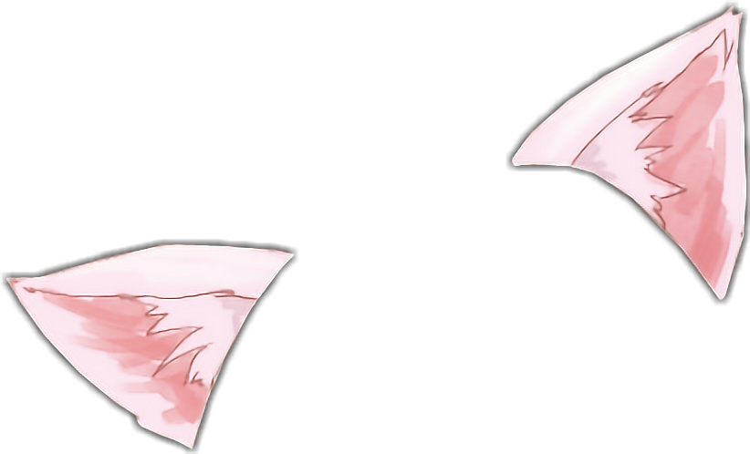
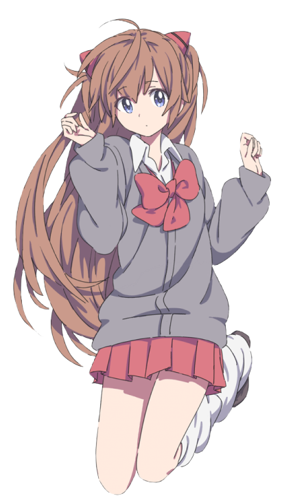

<h2>Hi, I'm Adrishyantee! </h2>

Core Team Member <a href="https://github.com/dsckgec">@DSC KGEC</a>

<h4> Current Focus: </h4>

  - App Development
  - Data Structures and Algorithms
  - Building Community Projects
  - Maintaining contribution streak on github!
-----
- 🔭 I’m currently working on  [Resumie](https://github.com/DSCKGEC/Resumie)
- 🌱 I’m currently learning  [DSA](https://github.com/adrishyantee/myDSA)
- 👯 I’m looking to collaborate on  [DocLense](https://github.com/smaranjitghose/DocLense)
-----

